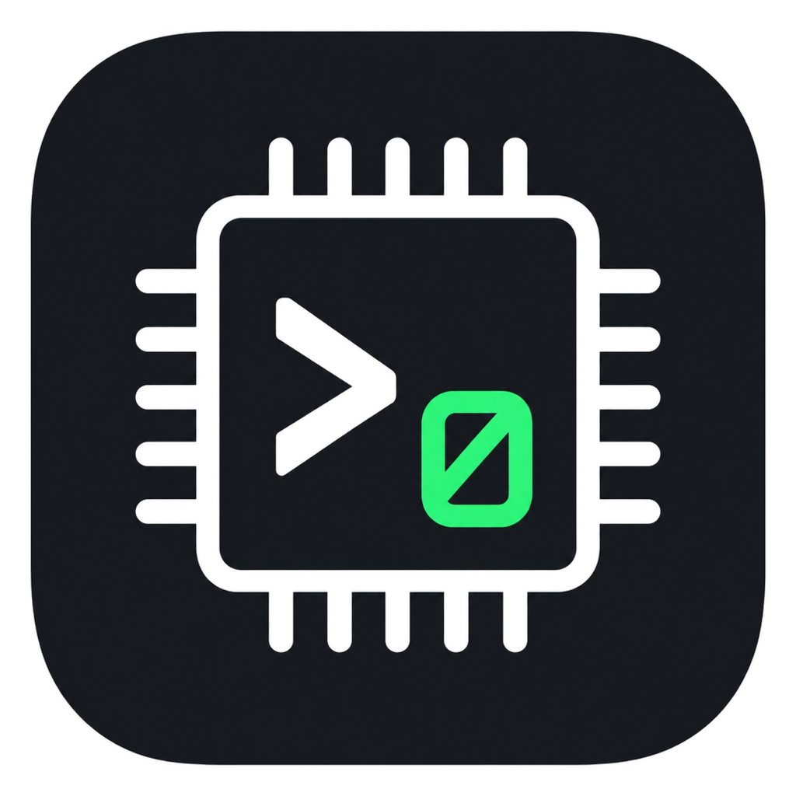

# term0



`term0` is a small serial terminal written in C++ with Qt 6. It is intended
for Windows, Linux, and macOS.

Current functionality includes serial port discovery and hot-plug handling,
text and HEX transmit, Text/HEX/HEX dump receive views, command history,
text logging, RX/TX counters, connection time, and configurable serial framing.

Serial port and baud rate are available on the main window. `Ctrl+Alt+S` opens
the settings window with **Serial**, **View**, and **Log** tabs. The Serial tab
contains data bits, parity, stop bits, flow control, DTR, and RTS.

## Usage

The main window keeps port and baud rate visible. Press `Ctrl+Alt+S` to open
settings. Serial parameters are applied to the next connection. View and log
preferences can be changed without disconnecting. Settings are saved between
runs in a regular INI file. On Windows the file is stored at
`%APPDATA%\term0\term0.ini`; on Linux it is stored at
`~/.config/term0/term0.ini`.

Select a serial port and baud rate, then press **Connect**. Port discovery is
automatic. `F5` forces a manual rescan.

If an open USB serial device is removed, `term0` disconnects it. If the same
port appears again, it is selected again but is not automatically reconnected.

### Receive modes

**Text** displays printable data normally. CR, LF, and TAB are preserved;
other control bytes are displayed as `.`.

**HEX** displays every received byte as hexadecimal. A received `0A` starts a
new display row.

**HEX dump** displays 16 bytes per row with offsets and an ASCII column:

```text
00000000  00 4D 50 59 3A 20 63 61  6E 27 74 20 6D 6F 75 6E  |.MPY: can't moun|
00000010  74 20 66 6C 61 73 68 0D  0A 4D 69 63 72 6F 50 79  |t flash..MicroPy|
```

### Transmit

Enter text in the Send field and press Enter or **Send**. **CR** and **LF**
control which line ending bytes are appended in text mode.

Use Up/Down in the Send field to browse commands sent during the current
application session.

Enable **HEX** next to the Send field to send byte values instead of text:

```text
00 4D 50 59
```

Compact input such as `004D5059` and optional `0x` prefixes are also accepted.
CR/LF are not added automatically in HEX transmit mode; send `0D` and `0A`
explicitly when needed.

### Logging

The **Log** tab in Settings selects the live log format: **Text**, **HEX**, or
**HEX dump**. Timestamps can also be enabled. These options are used the next
time a live log is started.

Press **Log** and choose a `.txt` file. The suggested filename reflects the
selected format (`term0-log.txt`, `term0-log_hex.txt`, or
`term0-log_hexdump.txt`). When timestamps are enabled, the current local date
and time are appended to the suggested filename. New RX data is written to that
file from that point onward. Press **Stop Log** to flush and close the file.

**Text** logging follows the Text receive convention: CR/LF/TAB are preserved
and other control bytes are written as `.`. **HEX** follows the HEX view line
break behavior. **HEX dump** writes 16-byte rows with offsets and an ASCII
column. With timestamps enabled, each logged row/line is prefixed with a local
date and time.

`Ctrl+S` still saves the retained RX history as plain text. This can be used
when output was received before live logging was started.

### Other controls

- **Clear** clears the terminal display.
- `Ctrl+L` also clears the terminal display.
- `Ctrl++` / `Ctrl+-` changes the terminal font size.
- `Ctrl+0` resets the terminal font size.
- `Ctrl` + mouse wheel also changes the terminal font size.
- `F5` forces a serial port rescan.
- The status line shows the current port/settings, connection time, and RX/TX
  byte counters. While logging it also shows the logged byte count.

A small clue in the View tab points to one undocumented shortcut.

## Requirements

- CMake 3.21 or newer
- Ninja
- Qt 6.2 or newer with `Widgets`, `SerialPort`, and `Concurrent`
- a C++20 compiler

## Build

### Windows

The easiest setup is Qt Online Installer with a 64-bit MinGW desktop kit.
Install the matching Qt Serial Port component as well as CMake, Ninja, and
MinGW.

If the Qt tools and compiler are available through `PATH`, build with:

```powershell
.\build-windows.bat
```

The executable is created at:

```text
build-windows\term0.exe
```

If `windeployqt` is also available through `PATH`, the script creates a
portable directory automatically:

```text
dist\
    term0.exe
    Qt6*.dll
    platforms\
    ...
```

Keep the complete `dist` directory together. To distribute a portable build,
zip the contents of `dist`; do not copy only `term0.exe`.

If Qt is not in `PATH`, the same build can be run directly through the Qt CMake
wrapper. For example, with Qt 6.12.0 installed in `C:\Qt`:

```powershell
& "C:\Qt\6.12.0\mingw_64\bin\qt-cmake.bat" `
    -S . `
    -B build-windows `
    -G Ninja `
    -DCMAKE_BUILD_TYPE=Release

cmake --build build-windows --parallel
```

To prepare the executable for use on another Windows machine:

```powershell
New-Item -ItemType Directory -Force dist | Out-Null
Copy-Item .\build-windows\term0.exe .\dist\term0.exe
& "C:\Qt\6.12.0\mingw_64\bin\windeployqt.exe" `
    --release `
    --no-translations `
    .\dist\term0.exe
```

Adjust the Qt path to match the installed version.

### Linux

On Debian/Ubuntu, install the compiler, CMake, Ninja, Qt development files, and
Qt Serial Port development files.

Depending on the distribution release, the Serial Port package may be named
`qt6-serialport-dev`:

```bash
sudo apt install build-essential cmake ninja-build qt6-base-dev qt6-serialport-dev
```

or `libqt6serialport6-dev`:

```bash
sudo apt install build-essential cmake ninja-build qt6-base-dev libqt6serialport6-dev
```

Build with:

```bash
./build-linux.sh
```

The executable is created at:

```text
build/term0
```

If access to a physical serial device is denied, check the device permissions.
On Debian/Ubuntu, USB serial devices are commonly assigned to the `dialout`
group:

```bash
sudo usermod -aG dialout "$USER"
```

Log out and back in after changing group membership.

### macOS

Install Qt 6 with the Serial Port module, CMake, Ninja, and a C++20 compiler.
Then build with the Qt CMake wrapper:

```bash
/path/to/Qt/6.x/macos/bin/qt-cmake \
    -S . \
    -B build \
    -G Ninja \
    -DCMAKE_BUILD_TYPE=Release

cmake --build build --parallel
```

CMake creates `term0.app` and includes the application icon in the bundle.

## Run

### Windows

Run the local build with:

```powershell
.\build-windows\term0.exe
```

For a portable build, run:

```powershell
.\dist\term0.exe
```

The DLLs and plugin directories created by `windeployqt` must remain next to
the executable.

### Linux

```bash
./build/term0
```

### macOS

```bash
open ./build/term0.app
```


## Testing without serial hardware on Linux

A virtual serial pair can be created with `socat`:

```bash
socat -d -d pty,raw,echo=0 pty,raw,echo=0
```

It prints two `/dev/pts/N` paths. Enter one path in `term0` and use the other
from a shell. For example:

```bash
printf '\x00MPY: test\r\n' > /dev/pts/N
```

## License

BSD 3-Clause License.
